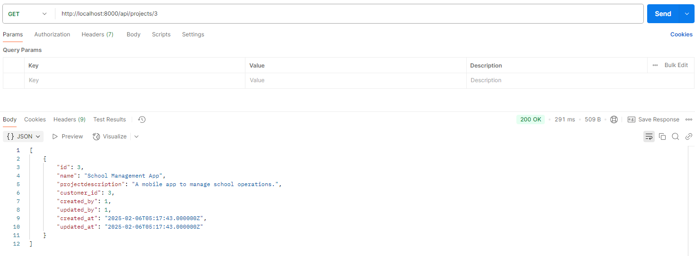
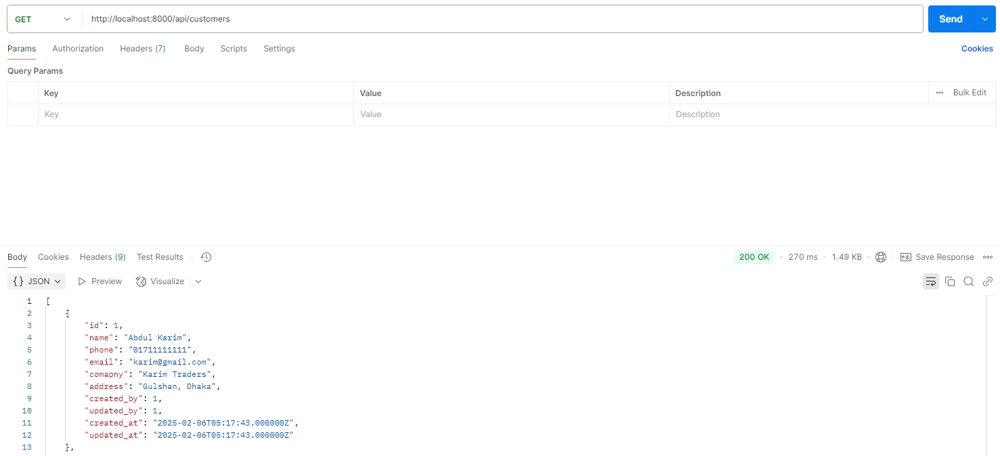

# Project Cost Management System - Documentation
<p>
This Project Cost Management System is a Laravel-based application designed to manage customer projects and their associated costs. It provides an API to fetch customers, retrieve projects by customer, store project costs, and list all project costs.
</p>

### Features
* Customer and project management
* Project cost tracking with unique tracking IDs
* RESTful API for retrieving and storing data

### Installation Guide

#### Prerequisites
Ensure your system meets the following requirements:
* PHP >= 8.2
* Composer
* MySQL
* Laravel 10

# Clone the Repository
git clone 
cd project-cost-management

# Install Dependencies
composer install

# Configure Environment Variables
cp .env.example .env

# Update .env with database configurations
DB_CONNECTION=mysql
DB_HOST=127.0.0.1
DB_PORT=3306
DB_DATABASE=project_cost_entry
DB_USERNAME=root
DB_PASSWORD=

# Generate Application Key
php artisan key:generate

# Run Migrations and Seeders
php artisan db:seed

# Serve the Application
php artisan serve

```The application will be accessible at http://127.0.0.1:8000```


### API Endpoints

#### Retrieve Customers
```GET /api/customers```
Response: Returns a list of all customers.

#### Retrieve Projects by Customer
```GET /api/projects/{customer_id}```
Response: Returns projects linked to a specific customer.

#### Store Project Costs
```POST /api/project-cost```

#### Payload:

```
{
  "rows": [
    { "customer_id": 1, "project_id": 2, "cost": 1000.50 }
  ]
}
```

Response: 201 Created with a success message.

#### List All Project Costs
```GET /api/project-cost```

Response: Returns a list of all stored project costs with customer and project details.

### Troubleshooting
* If migrations fail, check the database credentials in ```.env```

* If ```Class not found``` error occurs, run ```composer dump-autoload```

* If authentication fails, ensure Sanctum middleware is applied properly


## Screen Shoot


