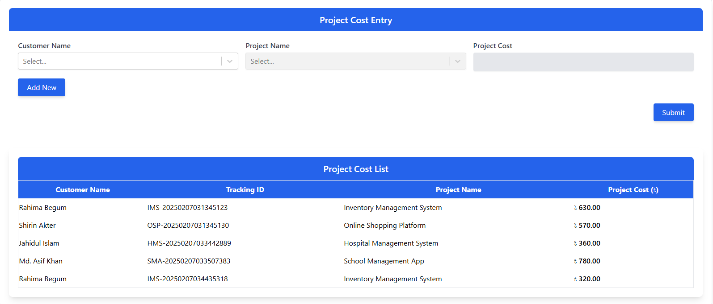

# Project Cost Entry - Documentation
### Project Overview
<p>
This is a React.js web application designed for managing project costs efficiently. It allows users to select customers, fetch their related projects, enter costs, and submit the data to an API. The project also displays an updated cost list dynamically.
</p>

## System Requirements
### Prerequisites
Ensure that you have the following installed on your system before proceeding:

* ```Node.js: >= 16.0.0 (Recommended: Latest LTS)```
* ```npm: >= 8.0.0 (Node Package Manager)```
* ``Git (Optional, if cloning via Git)``

### Installed Packages
Here are the main dependencies used in this project:

## Core Dependencies

| Package         | Version  | Description |
|--------------- |---------|-------------|
| `react`        | ^19.0.0 | Core React framework |
| `react-dom`    | ^19.0.0 | React's DOM rendering library |
| `react-scripts` | 5.0.1  | Scripts and configurations for Create React App |
| `react-select`  | ^5.10.0 | Provides a beautiful and customizable dropdown selection |
| `axios`        | ^1.7.9  | HTTP client for making API requests |
| `react-toastify` | ^11.0.3 | Used for displaying notifications in the UI |
| `react-dotenv` | ^0.1.3  | Enables .env environment variable support |


## Installation Instructions
Follow these steps to set up and run the project on your local machine.

### Step 1: Clone the Repository
If you haven't downloaded the project yet, clone it using Git:
* cd project-cost-entry

```Alternatively, you can download the ZIP file and extract it.```

### Step 2: Install Dependencies
```npm install```
This will install all required dependencies listed in the ```package.json``` file.

### Step 3: Setup Environment Variables
* REACT_APP_BASE_API_URL=http://localhost:3000

### Step 4: Start the Development Server
* ```npm start```
This will start the development server, and you can access the app in your browser at:


### Step 5: Build the Project (For Production)
To generate a production-ready build:
```npm run build```
This will create an optimized production build in the ```build/``` directory.

### API Endpoints

| Method | Endpoint                          | Description |
|--------|----------------------------------|-------------|
| `GET`  | `/api/customers`                 | Fetch all customers |
| `GET`  | `/api/projects/{customer_id}`    | Fetch projects by customer ID |
| `POST` | `/api/project-cost`              | Submit project cost details |
| `GET`  | `/api/project-cost`              | Fetch project cost list |


## Common Issues & Troubleshooting

### Port Already in Use
If you see an error like:
* Something is already running on port 3000.
```Run:```
PORT=3001 npm start

This will start the app on a different port (e.g., http://localhost:3001).

### Environment Variables Not Loading

#### Ensure:
* You have created a ```.env``` file.
* You restarted the server after modifying ```.env```.

### API Not Fetching Data
* Check if your backend is running and accessible.
* Ensure ```REACT_APP_BASE_API_URL``` is correctly set in .env.
* Verify network requests using the browser’s developer console ```(F12 > Network tab)```.

# 🎉 Congratulations! You’re all set to run the Project Cost Entry app. Happy coding! 🚀

### Let me know if you need any modifications! 😃

## Screen Shoot
